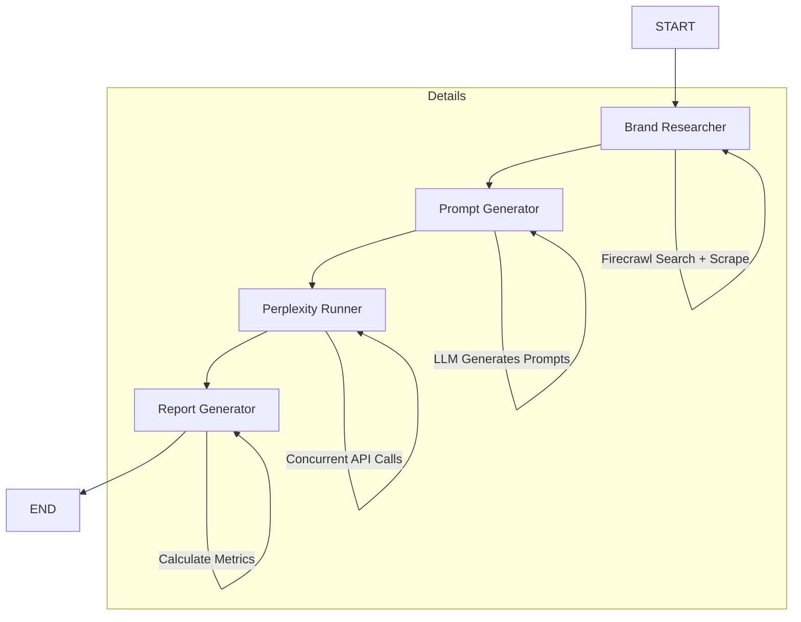

# 🥄 SPOON


A multi-agent workflow that evaluates how well a product or brand is exposed on [Perplexity AI](https://www.perplexity.ai/).  
Given a domain name, the system automatically:

1. **Researches** the brand (web search + homepage scraping → LLM extraction)
2. **Generates** realistic user prompts (user-configurable count) a real person might ask Perplexity
3. **Queries** Perplexity with all prompts in parallel
4. **Produces** a structured exposure report with metrics, examples, sources, and a narrative summary

The project includes a **FastAPI backend** and a minimalist **React frontend**.

---

## Agent Workflow


## Setup & Running

### Prerequisites

- Python 3.11+
- Node.js 18+
- [Poetry](https://python-poetry.org/docs/#installation)

### 1. Backend Setup

1. **Install dependencies**:
   ```bash
   poetry install
   ```

2. **Configure Environment**:
   ```bash
   cp .env.example .env
   # Edit .env with your API keys (OPENAI_API_KEY, PERPLEXITY_API_KEY, FIRECRAWL_API_KEY)
   ```

3. **Run the Server**:
   ```bash
   poetry run uvicorn app.main:app --reload
   ```
   The API will be available at `http://localhost:8000`.

### 2. Frontend Setup

1. **Navigate to frontend directory**:
   ```bash
   cd frontend
   ```

2. **Install dependencies**:
   ```bash
   npm install
   ```

3. **Run the Development Server**:
   ```bash
   npm run dev
   ```
   The UI will be available at `http://localhost:5173`.

---

## Usage

1. Open the frontend at `http://localhost:5173`.
2. Enter a **domain name** (e.g., `perplexity.ai`, `linear.app`).
3. Adjust the **number of prompts** to generate (1-20).
4. Click **Analyze Brand**.
5. View the report:
   - **Exposure Rate**: Percentage of times the brand was mentioned.
   - **Summary**: Qualitative analysis of the brand's presence.
   - **Examples**: Detailed breakdown of prompts where the brand appeared vs. missed, including sources used by Perplexity.

---

## Environment Variables

| Variable | Description | Required |
|----------|-------------|:--------:|
| `OPENAI_API_KEY` | OpenAI API Key for GPT-4o. | ✅ |
| `FIRECRAWL_API_KEY` | Firecrawl API Key for web search & scraping. | ✅ |
| `PERPLEXITY_API_KEY` | Perplexity API Key for running queries. | ✅ |
| `LLM_MODEL` | LLM model name (default: `gpt-4o`). | ❌ |
| `LOG_LEVEL` | Logging level (default: `INFO`). | ❌ |
| `PERPLEXITY_MAX_WORKERS` | Max concurrent requests to Perplexity (default: `5`). | ❌ |
| `WORKFLOW_TIMEOUT` | Max execution time in seconds (default: `300`). | ❌ |

---

## API Endpoints

- `POST /api/v1/evaluate`: Run the full evaluation workflow.
  - Body: `{"domain": "example.com", "prompts_count": 5}`
- `GET /api/v1/health`: Check API status.

---

## Docker

1. **Build the image**:
   ```bash
   docker build -t spoon .
   ```

2. **Run the container**:
   ```bash
   docker run -p 8000:8000 --env-file .env spoon
   ```

---

## Testing

Run backend tests with:
```bash
poetry run pytest
```
